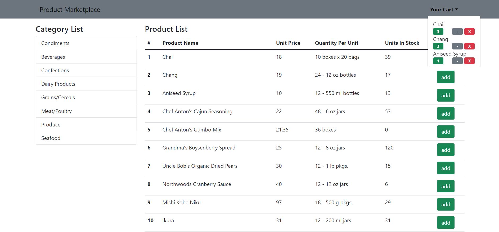

# React Product Marketplace



A project created for an overview of React. This project covers listing data by pulling data from an API, understanding state - props APIs, working with events, using conditional structures, simple routing, data exchange between parent child. At the same time, cart management was done. The user can add the products in stock to his cart and remove them in any quantity. In addition, products are filtered by category. (React'a genel bir bakış için oluşturulmuş bir proje. Bu proje bir api'dan veri çekerek verileri listelemeyi, state - props apılarını anlamayı, event'lar ile çalışmayı, koşullu yapılar kullanmayı, basit route'lama işlemini, parent child arası veri alışverişi kapsamaktadır. Aynı zamanda sepet yönetimi yapılmıştır. Kullanıcı stokta olan ürünleri sepetine ekleyip istediği miktarda çıkarabilmektedir. Ek olarak ürünler kategorilere göre filtrelenmektedir.)

([@engindemirog](https://github.com/engindemirog) hocama youtube'daki [react eğitimini](https://www.youtube.com/playlist?list=PLqG356ExoxZXEW9h1uTWCwqLLTJ_bO5Be) hazırladığı için teşekkür ederim.)

### Built With

* [React](https://reactjs.org/)
* [Bootstrap](https://getbootstrap.com/docs/5.0/getting-started/introduction/)
* [Reactstrap](https://reactstrap.github.io/?path=/story/home-installation--page)
* [Json Server](https://github.com/typicode/json-server)

## Getting Started

### Prerequisites
* npm
  ```sh
  npm install npm@latest -g
  ```

* json-server
  ```sh
  npm install -g json-server
  ```

* create-react-app (optional)
  ```sh
  npm install -g create-react-app
  ```

### Installation
1. Clone the repo
   ```sh
   git clone https://github.com/enesonmez/react-product-marketplace.git
   ```
2. Install NPM packages
   ```sh
   npm install
   ```
3. Json Api Run
   ```sh
    cd db
    json-server --watch db.json --port 3004
   ```
3. React Run
   ```sh
   npm start
   ```

## License
Distributed under the MIT License. See `LICENSE` for more information.

## Contact
Enes Sönmez - [@enesonmez](https://www.linkedin.com/in/enesonmez/) - enesonmezx@gmail.com

Project Link: [https://github.com/enesonmez/react-product-marketplace](https://github.com/enesonmez/react-product-marketplace)
